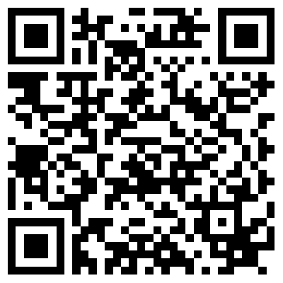

# RTD - supplementary material

Exercise material for the Research Training Day (RTD) *subsurface heat transport* on the 13th of November 2018.

Click on this badge  to start an interactive jupyter server. After the server is launched, you immediately can begin to work on the exercises.  
To test this on mobile, you can use this qr code:  

